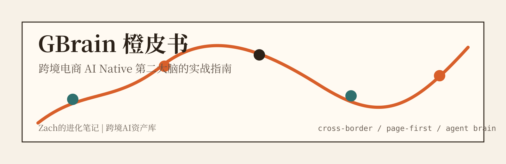

# 卖家第二大脑：GBrain 实战笔记

> Zach的进化笔记 | 跨境AI资产库

这不是一份 GBrain 命令速查，也不是把 README 翻译一遍。

这本书想回答一个更具体的问题：

**没有 AI 工程团队的跨境电商卖家，如何理解并借助 GBrain，把 LLM Wiki 的知识组织方法，升级成 Agent 可长期调用的 AI Native 第二大脑？**

本项目基于公开项目 [garrytan/gbrain](https://github.com/garrytan/gbrain) 及相关公开资料写成。当前重写版聚焦“跨境电商 + AI 知识库”：产品、流量、竞品、供应链和复盘判断，如何变成一套人能读、Agent 能用的长期业务记忆。

## 关于作者

**Zach**，公众号「Zach的进化笔记」主理人。

现在主要关注 AI Native 跨境电商公司的搭建：Skill、MCP、知识库、Agent 工作流，以及这些东西怎么真正落到电商团队的日常经营里。能开源的实践，会尽量开源。

关注公众号「Zach的进化笔记」，回复「第二大脑」可以获得PDF以及加入读者群。

  

## 下载

| 格式 | 文件 |
|---|---|
| Markdown | [book/seller-second-brain.md](book/seller-second-brain.md) |
| HTML | [dist/seller-second-brain.html](dist/seller-second-brain.html) |
| PDF | [dist/seller-second-brain.pdf](dist/seller-second-brain.pdf)（v2.0，79 页，含章节导航书签） |

> 三种格式均已同步至 v2.0。推荐使用 PDF（含章节导航书签）或 HTML（含交互式目录）阅读。

## 核心判断

> 跨境电商 AI 化的下一个瓶颈不是工具不够多，而是 Agent 没有业务记忆。

- **Skill 和 MCP 解决的是"怎么做"，不解决"为什么这样做"。** 方法层和记忆层是两件事，大多数跨境 AI 方案只做了前者。
- **知识库不是资料库。** 把文件塞进 AI 不等于给它记忆；记忆是结构化的判断、关系和时间线，不是搜索结果。
- **这件事难在理解，不难在技术。** 安装 GBrain 半小时，但理解"什么该写成 page、什么该留在原始文件"需要业务判断。
- **人和 Agent 的长期协作，需要 Agent 拥有你的个人第二大脑。** 业务大脑服务组织，个人大脑服务你自己；这份理解不应该被锁在任何一个模型或平台里。

## 这本书讲什么

| 部分 | 章节 | 主题 |
|---|---|---|
| 第一部分 | 00-01 | 为什么跨境电商团队迟早要建设 AI 第二大脑，以及这本书怎么跳读 |
| 第二部分 | 02-03 | 三条路线对比（RAG / LLM Wiki / GBrain）和为什么值得单独写一本书 |
| 第三部分 | 04-07 | 基础概念三层、page-first 与双读者设计、Obsidian 和 GBrain 的分工与理解门槛 |
| 第四部分 | 08-13 | 跨境业务知识对象、正式页 / 来源摘要页 / 治理页、schema、resolver、Skill / MCP、Skill 能力和团队工具分工 |
| 第五部分 | 14-22 | 从 20 条低风险知识样本到复盘 MVP、竞品分析、sync / embed / query / eval、企业级接入、双脑架构和个人大脑实操 |
| 第六部分 | 23-26 | 写入边界、风险、不同团队的落地建议和长期判断 |

## 适合谁读

- 非技术卖家老板：想判断 AI 第二大脑值不值得做、从哪里开始。
- 懂一点 AI 工具的运营负责人：想把飞书、Obsidian、GBrain、Codex、Skill、MCP 放进同一条业务链路。
- 准备搭内部 AI 工作流的执行者：想理解 page、schema、resolver、sync、embed、query、MCP 和 eval 怎么落地。
- 已经看过 Obsidian + LLM Wiki，但发现 demo 容易、工程化困难的人。
- 想在团队之外建个人 AI 增强、让 Agent 跨模型记住你的人。

## 不适合谁读

- 只想找普通笔记软件。
- 只想做一次性报表分析。
- 没有复盘节奏，也不愿意维护结构化页面。
- 希望把业务决策完全交给 AI 自动执行。

## 项目来源

这本书参考：

- [garrytan/gbrain](https://github.com/garrytan/gbrain)
- [GBrain Skillpack docs](https://github.com/garrytan/gbrain/blob/master/docs/GBRAIN_SKILLPACK.md)
- [GBrain SECURITY.md](https://github.com/garrytan/gbrain/blob/master/SECURITY.md)
- [Garry Tan 关于 GBrain total recall 的 X 推文](https://x.com/garrytan/status/2042497872114090069)
- [Garry Tan 关于 GBrain voice/context 的 X 推文](https://x.com/garrytan/status/2043103243732226496)
- [Y Combinator: Garry Tan](https://www.ycombinator.com/people/garry-tan)
- [Karpathy 的 LLM Wiki gist](https://gist.github.com/karpathy/442a6bf555914893e9891c11519de94f)
- [Repo Explainer 对 GBrain 的解读](https://repo-explainer.com/garrytan/gbrain/)
- [ChooseAI 对 GBrain 的中文介绍](https://www.chooseai.net/news/3236/)
- [XTrace 对 AI Memory 工具版图的分析](https://xtrace.ai/blog/every-tool-is-solving-a-different-memory-problem)

完整来源见 [references/sources.md](references/sources.md)。Garry Tan X 推文与 GBrain skillpack 的二次拆解见 [references/source-digests/garrytan-x-gbrain-2026-05-13.md](references/source-digests/garrytan-x-gbrain-2026-05-13.md)；v0.9 新增 Skill 能力与企业级 Remote MCP 接入拆解见 [references/source-digests/gbrain-skillpack-enterprise-mcp-2026-05-14.md](references/source-digests/gbrain-skillpack-enterprise-mcp-2026-05-14.md)。

## 许可

本书采用 [CC BY-NC-SA 4.0](https://creativecommons.org/licenses/by-nc-sa/4.0/) 许可发布。

GBrain 项目本身采用 MIT License。本书是公开资料解读，不是 GBrain 官方文档。
